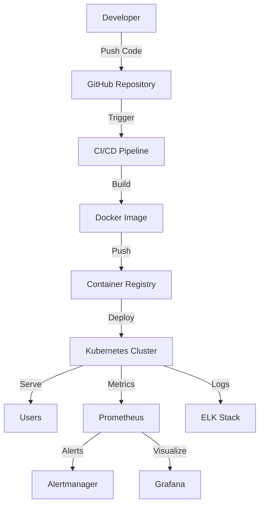

# ADK-WEB React Application - Deployment Documentation

## Table of Contents

1. [Overview](#overview)
2. [Prerequisites](#prerequisites)
3. [Infrastructure Requirements](#infrastructure-requirements)
4. [Deployment Architecture](#deployment-architecture)
5. [Environment Configuration](#environment-configuration)
6. [CI/CD Pipeline](#cicd-pipeline)
7. [Deployment Process](#deployment-process)
8. [Monitoring and Logging](#monitoring-and-logging)
9. [Security Configuration](#security-configuration)
10. [Performance Optimization](#performance-optimization)
11. [Rollback Procedures](#rollback-procedures)
12. [Troubleshooting](#troubleshooting)
13. [Maintenance](#maintenance)

## Overview

This document provides comprehensive deployment documentation for the ADK-WEB React application, covering all aspects of production deployment, monitoring, and maintenance.

## Prerequisites

### Software Requirements

- **Kubernetes**: v1.25+
- **Docker**: v20.10+
- **Node.js**: v18.x (for build process)
- **npm**: v9.x
- **kubectl**: v1.25+
- **helm**: v3.10+
- **Git**: v2.30+
- **curl**: Latest version
- **jq**: v1.6+

### Hardware Requirements

**Minimum Production Requirements:**
- 4 CPU cores
- 8GB RAM
- 50GB SSD storage
- Kubernetes cluster with at least 3 worker nodes

**Recommended Production Requirements:**
- 8 CPU cores
- 16GB RAM
- 100GB SSD storage
- Kubernetes cluster with 4+ worker nodes
- Load balancer with SSL termination

## Infrastructure Requirements

### Kubernetes Cluster

```yaml
# Minimum cluster configuration
apiVersion: v1
kind: Cluster
metadata:
  name: adk-web-production
spec:
  version: 1.25.0
  nodes:
    - role: master
      count: 3
      instanceType: n2-standard-4
    - role: worker
      count: 4
      instanceType: n2-standard-8
  networking:
    podCIDR: 10.244.0.0/16
    serviceCIDR: 10.96.0.0/12
```

### Networking

- **Ingress Controller**: NGINX Ingress Controller
- **Service Mesh**: Istio (optional for advanced traffic management)
- **DNS**: Configured with wildcard domain for staging and production
- **Load Balancer**: Cloud provider load balancer with SSL termination
- **Firewall Rules**: Configured to allow HTTP/HTTPS traffic

### Storage

- **Persistent Storage**: 100GB SSD for logs and metrics
- **Backup Storage**: 200GB for database backups and application snapshots
- **CDN**: Configured for static asset caching

## Deployment Architecture



## Environment Configuration

### Environment Variables

**Production Environment (`.env.production`):**

```env
# Application Configuration
NODE_ENV=production
APP_VERSION=1.0.0
PORT=80
API_BASE_URL=https://api.adk-web.production

# Feature Flags
ENABLE_ANALYTICS=true
ENABLE_ERROR_REPORTING=true
ENABLE_PERFORMANCE_MONITORING=true

# Logging
LOG_LEVEL=info
LOG_FORMAT=json

# Security
SESSION_SECRET=your-strong-secret-key
JWT_SECRET=your-jwt-secret
CSRF_TOKEN_SECRET=your-csrf-secret

# API Configuration
API_TIMEOUT=30000
API_RETRY_ATTEMPTS=3
API_RETRY_DELAY=1000

# Monitoring
METRICS_PORT=9090
HEALTH_CHECK_INTERVAL=30000

# Performance
CACHE_TTL=3600
MAX_CACHE_SIZE=1000
COMPRESSION_LEVEL=6

# Database
DB_HOST=postgres.adk-web-production
DB_PORT=5432
DB_NAME=adk_web
DB_USER=adk_web_user
DB_PASSWORD=your-strong-db-password
DB_SSL=true

# Redis
REDIS_HOST=redis.adk-web-production
REDIS_PORT=6379
REDIS_PASSWORD=your-redis-password
REDIS_SSL=true

# Analytics
GA_TRACKING_ID=UA-XXXXXXXX-X
SENTRY_DSN=https://your-sentry-dsn

# Rate Limiting
RATE_LIMIT_WINDOW=60000
RATE_LIMIT_MAX=100
```

### Configuration Files

**Docker Configuration:**
- `Dockerfile.production`: Multi-stage build for optimized production image
- `.dockerignore`: Files to exclude from Docker build context

**Kubernetes Configuration:**
- `kubernetes/staging/deployment.yaml`: Staging environment deployment
- `kubernetes/canary/deployment.yaml`: Canary deployment configuration
- `kubernetes/production/deployment.yaml`: Production deployment configuration

**NGINX Configuration:**
- `nginx/production.conf`: Production NGINX configuration with security headers

## CI/CD Pipeline

### Pipeline Overview

```mermaid
graph LR
    A[Code Push] --> B[Lint & Format]
    B --> C[Unit Tests]
    C --> D[Build]
    D --> E[Container Build]
    E --> F[Integration Tests]
    F --> G[Security Scan]
    G --> H[Staging Deployment]
    H --> I[E2E Tests]
    I --> J[Approval Gate]
    J --> K[Canary Deployment]
    K --> L[Gradual Rollout]
    L --> M[Post-Deployment Verification]
```



### Pipeline Stages

1. **Lint and Format Check**: ESLint and Prettier validation
2. **Unit Tests**: Jest test suite with coverage reporting
3. **Build**: Production build with Vite
4. **Container Build**: Multi-stage Docker build and push
5. **Integration Tests**: API integration testing
6. **Security Scan**: Snyk and Trivy vulnerability scanning
7. **Staging Deployment**: Deploy to staging environment
8. **E2E Tests**: Playwright end-to-end testing
9. **Approval Gate**: Manual approval for production
10. **Canary Deployment**: Limited rollout to 10% of traffic
11. **Gradual Rollout**: 25% → 50% → 75% → 100% deployment
12. **Post-Deployment Verification**: Health checks and monitoring

### Pipeline Configuration

**GitHub Actions Workflow:** `.github/workflows/production-deployment.yml`

**Key Features:**
- Automatic triggering on main branch pushes
- Manual trigger capability
- Comprehensive test coverage
- Security scanning integration
- Canary deployment strategy
- Gradual rollout with health checks
- Automatic rollback on failure

## Deployment Process

### Standard Deployment

```bash
# Deploy to staging environment
./scripts/deploy.sh 1.0.0 abc123def staging

# Deploy to production environment
./scripts/deploy.sh 1.0.0 abc123def production
```

### Deployment Scripts

**Main Deployment Script:** `scripts/deploy.sh`
- Handles Docker build and push
- Manages Kubernetes deployments
- Performs health checks
- Supports canary and gradual rollout

**Rollback Script:** `scripts/rollback.sh`
- Rolls back to previous deployment
- Supports specific revision rollback
- Verifies rollback success

**Monitoring Script:** `scripts/monitor.sh`
- Continuous health monitoring
- Resource usage tracking
- Log analysis
- Metrics collection

### Deployment Commands

```bash
# Check deployment status
kubectl get deployment adk-web -n adk-web-production

# Check pod status
kubectl get pods -n adk-web-production -l app=adk-web

# Check service status
kubectl get service adk-web -n adk-web-production

# Check ingress status
kubectl get ingress adk-web -n adk-web-production

# Check horizontal pod autoscaler
kubectl get hpa adk-web -n adk-web-production

# View deployment logs
kubectl logs -f deployment/adk-web -n adk-web-production

# Check resource usage
kubectl top pods -n adk-web-production
```

## Monitoring and Logging

### Monitoring Stack

**Components:**
- **Prometheus**: Metrics collection and storage
- **Alertmanager**: Alert routing and notification
- **Grafana**: Visualization and dashboards
- **Blackbox Exporter**: HTTP probe monitoring
- **Node Exporter**: System metrics collection

**Configuration Files:**
- `monitoring/prometheus-config.yaml`: Prometheus configuration
- `monitoring/alert-rules.yaml`: Alert rules and thresholds

### Key Metrics

**Application Metrics:**
- `requests_total`: Total HTTP requests
- `response_time_seconds`: Response time distribution
- `error_rate`: Error rate per endpoint
- `memory_usage_bytes`: Memory usage
- `cpu_usage_seconds`: CPU usage

**Infrastructure Metrics:**
- `node_memory_usage`: Node memory usage
- `node_cpu_usage`: Node CPU usage
- `node_disk_usage`: Node disk usage
- `pod_restarts`: Pod restart count

### Alerting

**Alert Severity Levels:**
- **Critical**: Immediate action required (e.g., application down)
- **Warning**: Potential issues requiring attention
- **Info**: Informational alerts

**Notification Channels:**
- Slack: `#alerts-critical`, `#alerts-warnings`, `#alerts-general`
- PagerDuty: Critical alerts only
- Email: Summary reports

### Logging

**Log Levels:**
- `error`: Critical errors and exceptions
- `warn`: Warning messages
- `info`: Informational messages (default)
- `debug`: Debug information
- `trace`: Detailed tracing

**Log Rotation:**
- Daily rotation
- 30-day retention
- Compressed archives

## Security Configuration

### Security Headers

```nginx
# Security headers in NGINX configuration
add_header Content-Security-Policy "default-src 'self'; script-src 'self' 'unsafe-inline' cdn.example.com;" always;
add_header Strict-Transport-Security "max-age=63072000; includeSubDomains; preload" always;
add_header X-Content-Type-Options "nosniff" always;
add_header X-Frame-Options "SAMEORIGIN" always;
add_header X-XSS-Protection "1; mode=block" always;
add_header Referrer-Policy "strict-origin-when-cross-origin" always;
add_header Permissions-Policy "geolocation=(), microphone=(), camera=()" always;
```

### SSL/TLS Configuration

```nginx
# SSL configuration
ssl_protocols TLSv1.2 TLSv1.3;
ssl_prefer_server_ciphers on;
ssl_ciphers "ECDHE-ECDSA-AES128-GCM-SHA256:ECDHE-RSA-AES128-GCM-SHA256:ECDHE-ECDSA-AES256-GCM-SHA384:ECDHE-RSA-AES256-GCM-SHA384:DHE-RSA-AES128-GCM-SHA256:DHE-RSA-AES256-GCM-SHA384";
ssl_session_timeout 1d;
ssl_session_cache shared:SSL:50m;
ssl_session_tickets off;
ssl_stapling on;
ssl_stapling_verify on;
```

### Rate Limiting

```nginx
# Rate limiting configuration
limit_req_zone $binary_remote_addr zone=api_limit:10m rate=100r/m;
limit_req_status 429;
limit_req zone=api_limit burst=20 nodelay;
```

### Security Best Practices

1. **Secrets Management**: Use Kubernetes secrets or external secrets manager
2. **Network Policies**: Restrict pod-to-pod communication
3. **Pod Security**: Run as non-root, read-only filesystems
4. **Image Scanning**: Regular vulnerability scanning
5. **RBAC**: Role-based access control
6. **Network Segmentation**: Isolate environments
7. **Regular Audits**: Security audits and penetration testing

## Performance Optimization

### Caching Strategies

**Browser Caching:**
```nginx
location ~* \.(js|css|png|jpg|jpeg|gif|ico|svg|woff|woff2|ttf|eot)$ {
    expires 1y;
    add_header Cache-Control "public, immutable";
}
```

**API Caching:**
- Redis cache with 5-minute TTL
- Cache invalidation on data changes
- Cache key versioning

**CDN Caching:**
- Cloudflare or AWS CloudFront
- Edge caching for static assets
- Cache purge API for content updates

### Compression

```nginx
# Gzip compression
gzip on;
gzip_vary on;
gzip_proxied any;
gzip_comp_level 6;
gzip_types text/plain text/css application/json application/javascript text/xml application/xml application/xml+rss text/javascript;
```

### Performance Monitoring

**Key Performance Indicators:**
- **Response Time**: < 500ms for 95th percentile
- **Error Rate**: < 0.1%
- **Availability**: 99.95% uptime
- **Throughput**: 1000+ requests per second
- **Concurrency**: Support 10,000+ concurrent users

**Optimization Techniques:**
- Code splitting and lazy loading
- Bundle optimization and tree shaking
- Image optimization and lazy loading
- Database query optimization
- Connection pooling
- Load balancing

## Rollback Procedures

### Automatic Rollback

The CI/CD pipeline includes automatic rollback on deployment failure:

```yaml
# Automatic rollback configuration
rollback:
  name: Rollback
  runs-on: ubuntu-latest
  needs: gradual-rollout
  if: failure()
  steps:
    - name: Rollback deployment
      run: kubectl rollout undo deployment/adk-web -n adk-web-production
```

### Manual Rollback

```bash
# Rollback to previous revision
./scripts/rollback.sh

# Rollback to specific revision
./scripts/rollback.sh 5

# Check deployment history
kubectl rollout history deployment/adk-web -n adk-web-production
```

### Rollback Verification

1. **Health Checks**: Verify application health endpoints
2. **Pod Status**: Check Kubernetes pod status
3. **Resource Usage**: Monitor CPU/memory usage
4. **Error Rates**: Check for increased error rates
5. **User Impact**: Monitor user experience metrics

## Troubleshooting

### Common Issues and Solutions

**Issue: Application not responding**
- Check pod status: `kubectl get pods -n adk-web-production`
- Check logs: `kubectl logs -f deployment/adk-web -n adk-web-production`
- Check resource usage: `kubectl top pods -n adk-web-production`
- Check ingress: `kubectl get ingress adk-web -n adk-web-production`

**Issue: High error rate**
- Check application logs for specific errors
- Verify API connectivity and health
- Check database connection and performance
- Review recent deployment changes

**Issue: Performance degradation**
- Check resource usage metrics
- Review response time metrics
- Analyze database query performance
- Check for network latency issues

**Issue: Deployment failure**
- Check CI/CD pipeline logs
- Verify Docker image build success
- Check Kubernetes resource quotas
- Review deployment configuration changes

### Debugging Commands

```bash
# Get detailed pod information
kubectl describe pod <pod-name> -n adk-web-production

# Get deployment events
kubectl get events -n adk-web-production --sort-by='.metadata.creationTimestamp'

# Get service endpoints
kubectl get endpoints adk-web -n adk-web-production

# Test connectivity to service
kubectl run -it --rm debug --image=busybox --restart=Never -- sh
wget -O- http://adk-web:80/health

# Check network policies
kubectl get networkpolicy -n adk-web-production

# Check resource quotas
kubectl get resourcequota -n adk-web-production
```

## Maintenance

### Regular Maintenance Tasks

**Daily:**
- Monitor application health and performance
- Check error logs and alerts
- Review resource usage metrics
- Verify backup completion

**Weekly:**
- Review security alerts and vulnerabilities
- Update dependencies and libraries
- Test backup restoration process
- Review monitoring dashboards and alerts

**Monthly:**
- Perform security audits
- Review access controls and permissions
- Test disaster recovery procedures
- Review and update documentation

**Quarterly:**
- Perform penetration testing
- Review and update security policies
- Test failover procedures
- Review capacity planning

### Backup Procedures

**Database Backups:**
- Daily automated backups
- 7-day retention for daily backups
- 4-week retention for weekly backups
- 12-month retention for monthly backups
- Encrypted backup storage

**Application Backups:**
- Configuration files backup
- Kubernetes manifest backup
- Docker image backup
- Secrets backup (encrypted)

**Backup Verification:**
- Weekly backup restoration testing
- Quarterly disaster recovery drills
- Backup integrity verification

### Update Procedures

**Minor Updates:**
1. Update version in package.json
2. Create Git tag
3. Push to main branch
4. Monitor automated deployment
5. Verify deployment success

**Major Updates:**
1. Create feature branch
2. Implement changes with feature flags
3. Test in staging environment
4. Merge to main branch
5. Monitor canary deployment
6. Gradual rollout to production
7. Monitor post-deployment metrics
8. Address any issues promptly

## Support Contacts

**Development Team:**
- Frontend Lead: frontend-lead@adk-web.production
- Backend Lead: backend-lead@adk-web.production
- DevOps Lead: devops-lead@adk-web.production

**Operations Team:**
- Production Support: support@adk-web.production
- Incident Response: incident@adk-web.production
- Security Team: security@adk-web.production

**Vendor Support:**
- Cloud Provider: cloud-support@provider.com
- Kubernetes Support: k8s-support@provider.com
- Monitoring Support: monitoring-support@provider.com

## Appendix

### Useful Links

- **Documentation**: https://docs.adk-web.production
- **API Documentation**: https://api-docs.adk-web.production
- **Status Page**: https://status.adk-web.production
- **Support Portal**: https://support.adk-web.production
- **GitHub Repository**: https://github.com/adk-web/react-adk-web

### Version History

| Version | Date | Changes |
|---------|------|---------|
| 1.0 | 2026-01-23 | Initial deployment documentation |
| 1.1 | 2026-01-30 | Added monitoring and alerting details |
| 1.2 | 2026-02-15 | Updated security configuration |

### Glossary

- **CDN**: Content Delivery Network
- **CI/CD**: Continuous Integration/Continuous Deployment
- **HPA**: Horizontal Pod Autoscaler
- **K8s**: Kubernetes
- **RBAC**: Role-Based Access Control
- **SLA**: Service Level Agreement
- **SLO**: Service Level Objective
- **TLS**: Transport Layer Security

This comprehensive deployment documentation provides all the information needed to successfully deploy, monitor, and maintain the ADK-WEB React application in production environments.