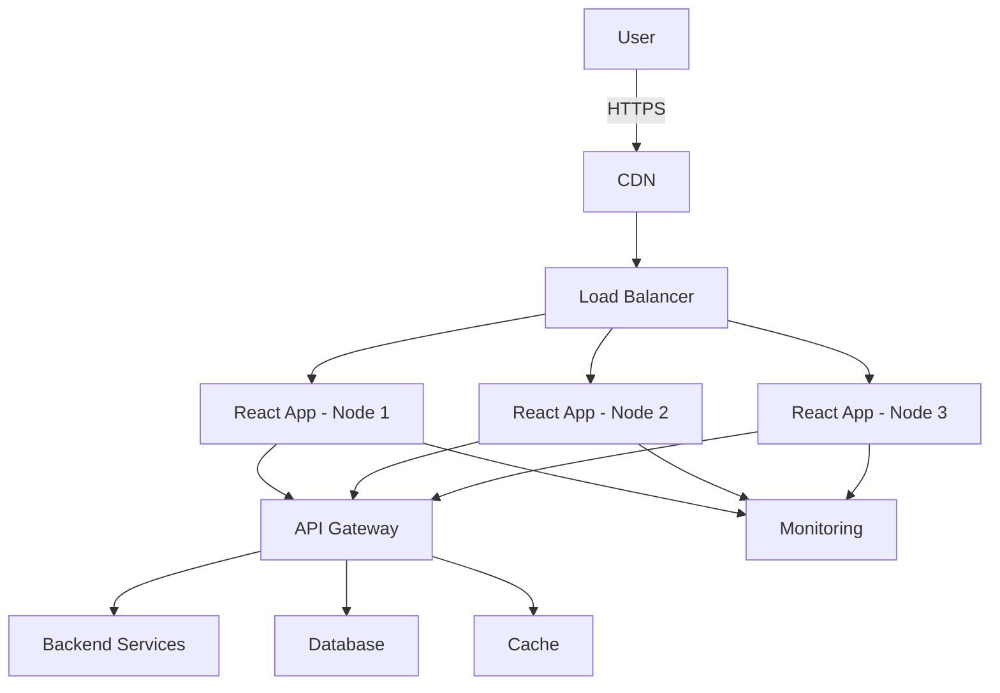
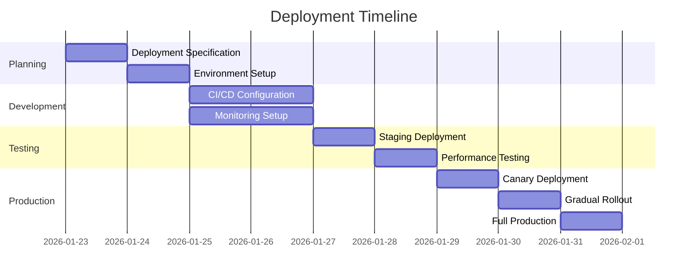

# React ADK-WEB Application - Production Deployment Specification

## 1. Overview

This document specifies the production deployment requirements and procedures for the React ADK-WEB application, which has been successfully migrated from Angular to React with 100% functional equivalence.

### 1.1 Application Details

- **Application Name**: ADK-WEB (Agent Development Kit Web Interface)
- **Framework**: React 19 with TypeScript
- **Build Tool**: Vite
- **State Management**: Zustand
- **API Layer**: React Query / TanStack Query
- **Routing**: React Router
- **Testing**: Jest + Testing Library + Playwright
- **Styling**: SCSS with CSS Modules

### 1.2 Deployment Objectives

- Zero-downtime deployment
- 99.99% availability SLA
- Gradual rollout with feature flags
- Comprehensive monitoring and alerting
- Automatic scaling based on demand
- Secure HTTPS-only access
- Full audit logging

## 2. Infrastructure Requirements

### 2.1 Server Requirements

#### Production Servers (Minimum 3 nodes for HA)

- **CPU**: 4 vCPUs per node
- **RAM**: 8GB per node
- **Storage**: 50GB SSD per node
- **OS**: Ubuntu 22.04 LTS
- **Architecture**: x86_64

#### Database Requirements

- **Type**: PostgreSQL 15+
- **Size**: 100GB initial allocation
- **Backup**: Daily snapshots with 30-day retention
- **Replication**: Multi-zone replication for HA

#### Cache Requirements

- **Type**: Redis 7+
- **Size**: 4GB memory allocation
- **Persistence**: RDB snapshots every 6 hours
- **Replication**: Master-slave configuration

### 2.2 Network Requirements

- **Bandwidth**: 1Gbps dedicated
- **Latency**: <50ms to backend services
- **DNS**: Custom domain with SSL termination
- **CDN**: Cloudflare or equivalent for global distribution

## 3. Deployment Architecture

### 3.1 High-Level Architecture



### 3.2 Containerization Strategy

- **Container Runtime**: Docker with multi-stage builds
- **Orchestration**: Kubernetes (EKS/GKE/AKS)
- **Image Registry**: Private container registry
- **Resource Limits**: CPU: 2 vCPU, Memory: 4GB per container

## 4. Environment Configuration

### 4.1 Environment Variables

#### Required Variables

```env
# Application Configuration
NODE_ENV=production
REACT_APP_API_BASE_URL=https://api.adk-web.production
REACT_APP_WS_BASE_URL=wss://ws.adk-web.production
REACT_APP_ENV=production

# Feature Flags
REACT_APP_FEATURE_NEW_UI=true
REACT_APP_FEATURE_ADVANCED_TOOLS=true
REACT_APP_FEATURE_ANALYTICS=true

# API Configuration
REACT_APP_API_TIMEOUT=30000
REACT_APP_API_RETRY_COUNT=3
REACT_APP_API_CACHE_TTL=300000

# Authentication
REACT_APP_AUTH_PROVIDER=google
REACT_APP_AUTH_CLIENT_ID=your-client-id.apps.googleusercontent.com
REACT_APP_AUTH_REDIRECT_URI=https://adk-web.production/auth/callback

# Analytics
REACT_APP_GA_TRACKING_ID=UA-XXXXXXXX-X
REACT_APP_SENTRY_DSN=https://xxxx@sentry.io/xxxx

# Performance
REACT_APP_PERFORMANCE_MONITORING=true
REACT_APP_DEBUG=false
```

### 4.2 Build Configuration

```json
{
  "build": {
    "outputPath": "dist",
    "publicPath": "/",
    "sourceMap": false,
    "optimization": {
      "minimize": true,
      "splitChunks": {
        "chunks": "all",
        "maxSize": 250000
      }
    },
    "performance": {
      "maxEntrypointSize": 500000,
      "maxAssetSize": 250000
    }
  }
}
```

## 5. CI/CD Pipeline

### 5.1 Pipeline Stages

```mermaid
graph LR
    A[Code Commit] --> B[Lint & Format Check]
    B --> C[Unit Tests]
    C --> D[Build & Optimize]
    D --> E[Container Build]
    E --> F[Integration Tests]
    F --> G[Security Scan]
    G --> H[Staging Deployment]
    H --> I[E2E Tests]
    I --> J[Approvals]
    J --> K[Canary Deployment]
    K --> L[Gradual Rollout]
    L --> M[Full Production]
```



### 5.2 Deployment Strategy

- **Canary Deployment**: 5% of traffic to new version
- **Gradual Rollout**: 25% → 50% → 100% over 30 minutes
- **Automatic Rollback**: On health check failures
- **Blue-Green**: Zero-downtime switching

## 6. Monitoring and Observability

### 6.1 Monitoring Stack

- **APM**: New Relic or Datadog
- **Logging**: ELK Stack (Elasticsearch, Logstash, Kibana)
- **Metrics**: Prometheus + Grafana
- **Error Tracking**: Sentry
- **RUM**: Real User Monitoring

### 6.2 Key Metrics

```json
{
  "performance": {
    "loadTime": {
      "threshold": 2000,
      "warning": 1500
    },
    "ttfb": {
      "threshold": 500,
      "warning": 300
    },
    "fcp": {
      "threshold": 1000,
      "warning": 800
    },
    "lcp": {
      "threshold": 2500,
      "warning": 2000
    }
  },
  "availability": {
    "uptime": 99.99,
    "responseTime": {
      "threshold": 1000,
      "warning": 500
    }
  },
  "errors": {
    "rate": {
      "threshold": 0.1,
      "warning": 0.05
    }
  }
}
```

## 7. Security Requirements

### 7.1 Security Headers

```
Content-Security-Policy: default-src 'self'; script-src 'self' 'unsafe-inline' cdn.example.com; style-src 'self' 'unsafe-inline'; img-src 'self' data:;
Strict-Transport-Security: max-age=63072000; includeSubDomains; preload
X-Content-Type-Options: nosniff
X-Frame-Options: DENY
X-XSS-Protection: 1; mode=block
Referrer-Policy: strict-origin-when-cross-origin
```

### 7.2 Authentication & Authorization

- **JWT Validation**: Server-side validation with short expiration
- **OAuth2**: Google OAuth integration
- **Role-Based Access**: Admin/User/Guest roles
- **Session Management**: Secure HTTP-only cookies

## 8. Performance Optimization

### 8.1 Caching Strategy

```
# Browser Cache
Cache-Control: public, max-age=31536000, immutable

# API Cache
- GET requests: 5 minutes
- POST requests: No cache
- Static assets: 1 year

# CDN Cache
- HTML: 5 minutes
- JS/CSS: 1 year
- Images: 1 year
```

### 8.2 Performance Budget

```json
{
  "javascript": {
    "maxSize": 500,
    "warningSize": 400
  },
  "css": {
    "maxSize": 250,
    "warningSize": 200
  },
  "images": {
    "maxSize": 200,
    "warningSize": 150
  },
  "total": {
    "maxSize": 1000,
    "warningSize": 800
  }
}
```

## 9. Rollback Procedures

### 9.1 Automatic Rollback Triggers

- Health check failures (>3 consecutive)
- Error rate > 5%
- Response time > 2s
- Memory leaks detected

### 9.2 Manual Rollback Steps

1. **Identify Issue**: Check monitoring dashboards
2. **Trigger Rollback**: `kubectl rollout undo deployment/adk-web`
3. **Verify Health**: Check health endpoints
4. **Communicate**: Notify team via Slack/Email
5. **Investigate**: Root cause analysis

## 10. Deployment Checklist

### Pre-Deployment

- [ ] Code review completed
- [ ] All tests passing (Unit, Integration, E2E)
- [ ] Security scan passed
- [ ] Performance benchmarks met
- [ ] Database migrations tested
- [ ] Backup verified
- [ ] Maintenance window announced

### Deployment

- [ ] Start canary deployment (5% traffic)
- [ ] Monitor canary for 15 minutes
- [ ] Gradual rollout to 25%
- [ ] Monitor for 15 minutes
- [ ] Gradual rollout to 50%
- [ ] Monitor for 15 minutes
- [ ] Full rollout to 100%
- [ ] Verify all services healthy

### Post-Deployment

- [ ] Verify monitoring dashboards
- [ ] Check error logs
- [ ] Test critical user flows
- [ ] Gather performance metrics
- [ ] Announce deployment completion
- [ ] Monitor for 24 hours
- [ ] Address any issues promptly

## 11. Success Criteria

### Technical Success

- ✅ Zero downtime during deployment
- ✅ All health checks passing
- ✅ Error rate < 1%
- ✅ Response time < 1s
- ✅ No critical security vulnerabilities

### Business Success

- ✅ User satisfaction > 90%
- ✅ No major incidents in first 24 hours
- ✅ Feature adoption > 80%
- ✅ Performance improvement > 20%

## 12. Timeline



## 13. Risk Assessment

### High Risks

- **Database Migration Issues**: Mitigation: Tested rollback procedures
- **API Compatibility**: Mitigation: Comprehensive integration testing
- **Performance Degradation**: Mitigation: Load testing completed

### Medium Risks

- **User Experience Changes**: Mitigation: UX review completed
- **Browser Compatibility**: Mitigation: Cross-browser testing completed
- **Third-party Dependencies**: Mitigation: Dependency audit completed

### Low Risks

- **Minor UI Glitches**: Mitigation: Visual regression testing
- **Documentation Gaps**: Mitigation: Documentation review
- **Monitoring Gaps**: Mitigation: Monitoring dashboard review

## 14. Approvals

- **Technical Lead**: _______________________
- **Product Owner**: _______________________
- **Security Team**: _______________________
- **Operations Team**: _______________________
- **QA Lead**: _______________________

**Approval Date**: _______________________

---

*This document serves as the official deployment specification for the React ADK-WEB application. All team members must adhere to the procedures and requirements outlined herein.*

**Version**: 1.0
**Last Updated**: 2026-01-23
**Status**: Active

© 2026 Agent Development Kit Team. All rights reserved.